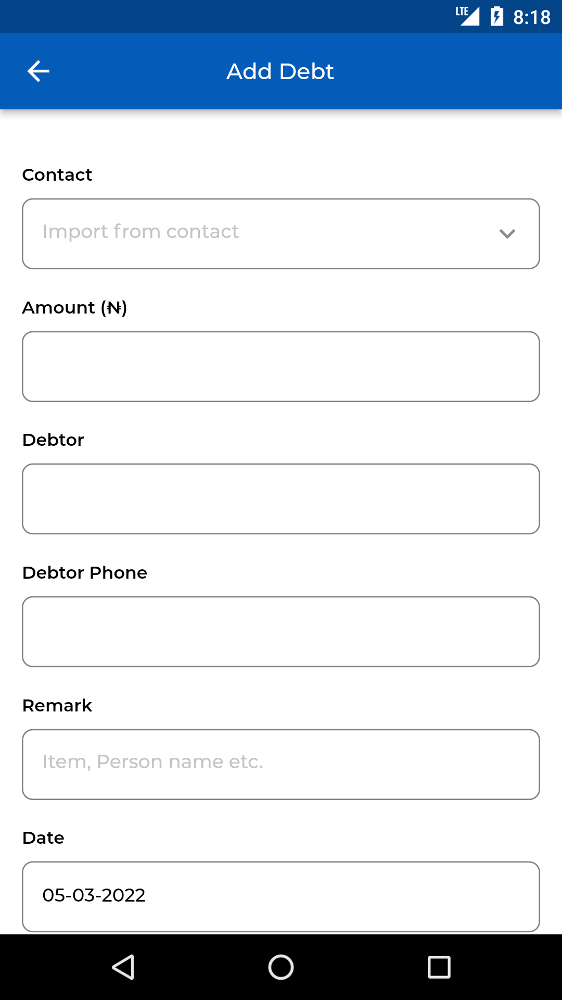

# pfm_app

A Personal finance management App.
------------- 

#### This App manages the debt and expense of a user.
#### Note: The App may take time to open due to some initialization happening at the backend. 

#### This App has only been tested on Android and not IOS.
#### Flutter Version Used :2.10.3

------------- 

## Screenshots  

  
   
  
  
   
  
  
  
  

------------- 

## Screens  
- Login and Signup Screen 
- Dahboard Screen  
- Debts Screen 
- Expenses Screen 
- Add Debts Screen 
- Add Expenses Screen 
- View and Edit Debts Screen 
- View and Edit Expenses Screen 
- Notification Screen

## Funcionality
- Firebase Authentication
- Firebase Firestore
- Biometric
- Push notification and sms
- contact importing
- Cloud functions

